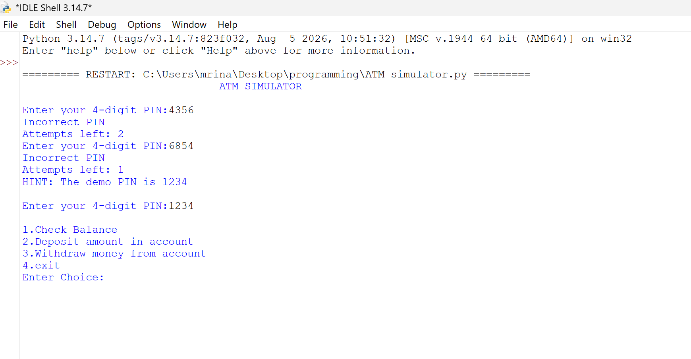
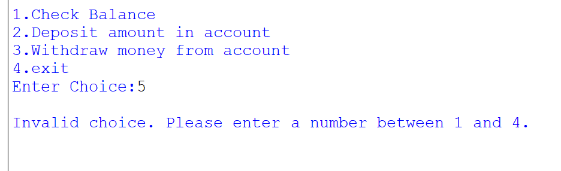
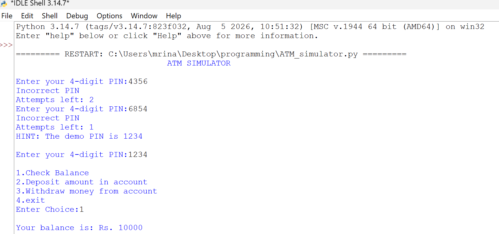
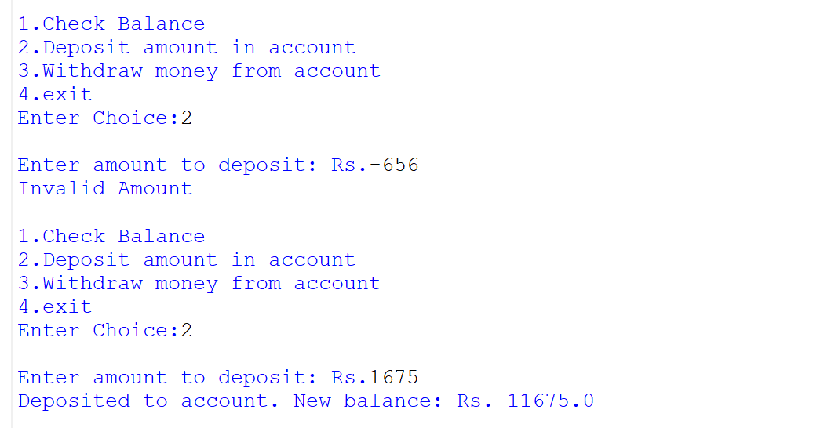
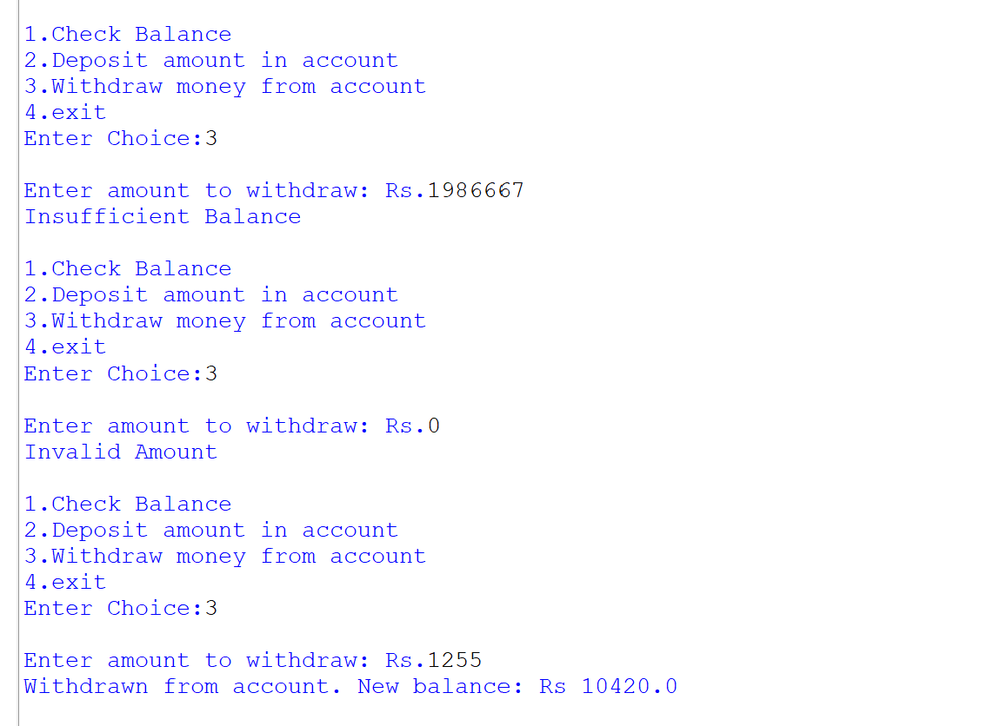

OVERVIEW:
A command-line ATM simulator built in python. In the program, the user is asked for a 4-digit PIN (3 attempts allowed), once logged in, lets the user check their balance, deposit, and withdraw money through a simple text menu.

FEATURES:
PIN-based login with a maximum of 3 attempts
A hint shown automatically when only 1 attempt
Blocks card access if all 3 attempts fail
once user is logged in, they can do the following:
check account balance
deposit money in account
withdraw money from account
exit the program as per wish

TECHNOLOGIES/TOOLS USED:
Python 3.14 (no external libraries)

FILES IN REPOSITORY:
1. ATM_simulator.py
2. README.md
3. Statement.md

STEPS TO INSTALL AND RUN THE PROGRAM:
1. Install Python 3 from https://www.python.org/downloads/ (no other installation needed).
2. Clone the repository:
   https://github.com/Av238i/ATM-Simulator.git
3. Go into the project folder:
   ATM-Simulator
4. run the program:
   python ATM_simulator.py

HOW TO USE:
1. Demo PIN: 1234. The program shows this as a hint after two wrong attempts. 
2. Starting balance: Rs. 10000.
3. Type the number of the menu option in choice and press Enter.
4. Amounts entered by the user must be whole numbers more than 0.

TESTING:
This project was tested manually by running the program with both valid as well as invalid inputs, such as invalid pin, valid pin, invalid amounts for depositing and withdrawing from given balance, and exiting. 

SCREENSHOTS:
1. entering pins:
   
2. invalid choice:
   
3. balance:
   
4. deposit:
   
5. withdrawal:
   
6. exit:
   
7. complete program:
   
   